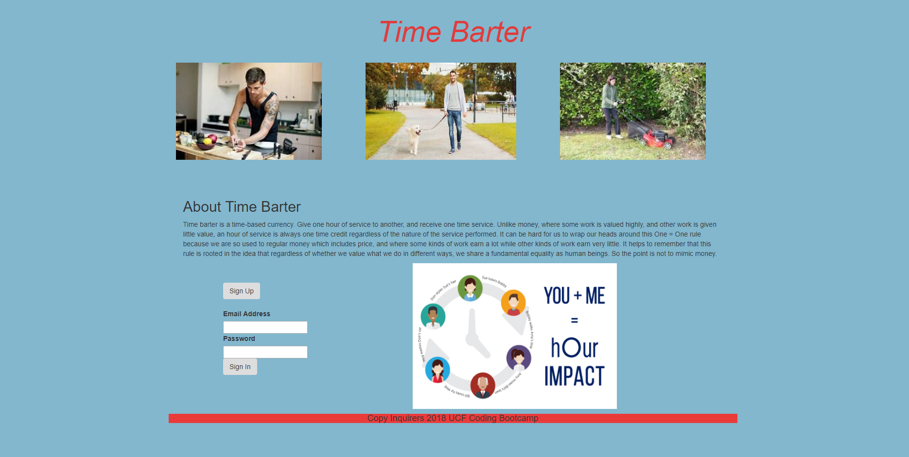

# Time_Barter_App
An App that allows users to barter services one hour at a time.

## About 
Time barter is a time-based currency. Give one hour of service to another, and receive one time service. 

## Deployment
The app is deployed on Heroku

## Functionality
Sequelize is utilized for ORM.
3 CRUD functions are implemented:
1. READ - entries from MySQL database are displayed on the DOM using Handlebars.
2. UPDATE - users can add additional services offered.
3. CREATE -  users can signup, which will trigger an update to add a new user.

Express routes direct users to a specified page.

## Screenshot
  * Home Page
  

  * Offers Page
   
   
   

## Authors
**Brian Elliston** - Team Lead & Front-End
**Sharona Young** - Database Development
**Ruha** - Authentication & Back-End

